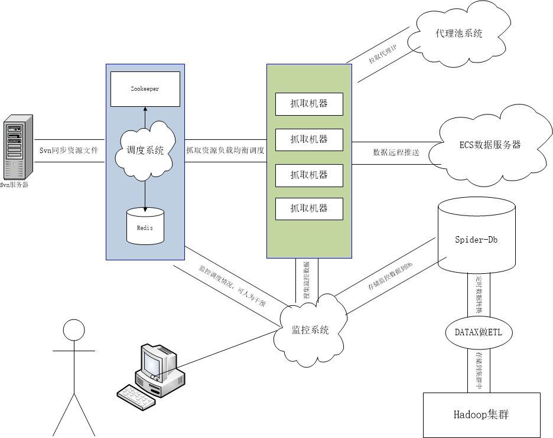

# 爬虫系统
根据任务文件，抓取页面内容

# 实现原理
读取抓取任务文件，利用线程池，执行相关任务

# 具备功能
* 任务文件只要符合规范，即可被爬虫解析，抓到到新闻
* 爬虫提供抓取平台，工作重心会放在前端json配置文件上
* 对接代理池平台，所有请求都走代理，防止IP反爬虫
* 可指定任务重试次数，代理重试次数，提高相关成功率
* 支持htmlunit，httpclient抓取引擎，默认走htmlunit的无js，其实也是httpclient
* 任务包执行时间可控，抓取实效时间可控
* 可配置使用浏览器查看跟踪抓取路径
* 数据推送支持http，dubbo两种方式，可做配置
* 抓取数据推送重试可控，过多失败自动转为离线推送
* 支持分布式爬虫，注册中心采用zookeeper，抓取文件由配置中心统一下发
* 抓取地址采用布隆过滤器，去重质量和效率较高，占用内存很少
* 抓取配置采用json，方便配置，解析

# 架构图
  

# 问题
本次改进，采用两组线程池，一组用来执行，一组用来控制超时时间。保证每个时间点，线程池中所有线程都处于执行中状态。

# 后期改进
* 图片抓取
* 视频抓取
* 参考ayncload框架，改造异步线程池

# 问题反馈
在使用中有任何问题，欢迎反馈给我，可以用以下联系方式跟我交流

* 邮件: (zhou5827297@163.com)
